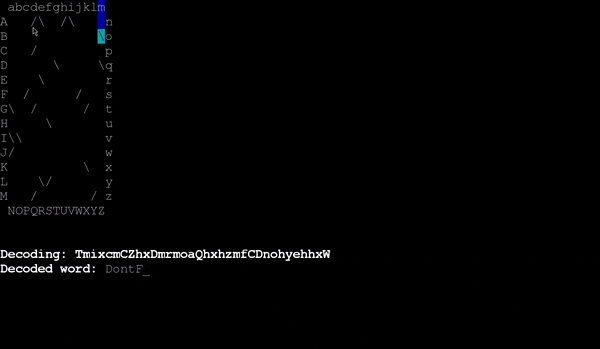

# Challenge Seven

Gif of 'fancy' version:

[Base version with shared code](./Decoder.scala)

['Fancy' version which extends Base version with basic animation](./FancyDecoder.scala)

['Fast' version which extends Base version with cached lookups](./FastDecoder.scala)
