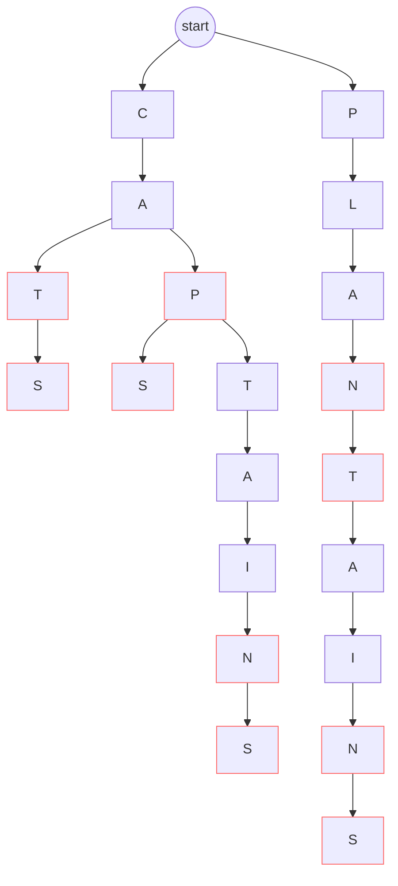

# Challege Six: Dictionary

There is a small CLI utility to test spellcheck that can be ran in sbt with `runMain digital.and.challenges.six.Main`, some example outputs:

```
Enter word to check spelling or empty to quit
> echochocolate
Invalid word, correct until echoc[hocolate]
Alternatives to complete word:
echocardiographer
echocardiographers
echocardiographic
echocardiographies
echocardiography
echocardiogram
echocardiograms
```

```
Enter word to check spelling or empty to quit
> k
Invalid word, correct until k[]
Alternatives to complete word:
ka
kaas
kab
kabab
kababs
kabar
kabars
kabaya
kabayas
kabaka
and 1705 more...
```

[Source for final dictionary implementation](./DawgDictionary.scala)

## Implementations

Included a few implementations, main use is the DAWG implementation below

### Naive Dictionary

[Source](./NaiveDictionary.scala)

Meant to be a 'baseline' implementation, will be very slow. Stores the entire dictionary as 1 big list.

`isWord` iterates to check if the word is in the list, checking is O(n)

`spellcheck` iterates once to check if is a word, if not then iterates again collecting suffixes for words that
share a common prefix, discarding unneeded collected suffixes when a longer prefix is found, still O(n) (ish)

### Trie Dictionary

[Source (ignoring .minimize)](./DawgDictionary.scala)

Storage improved by using a Trie to store dictionary as shown:

*words: cat, cats, caps, cap, captain, captains, plant, plantain, plantains*

Red border = flag for 'this is an actual word'

![Trie example](https://mermaid.ink/img/eyJjb2RlIjoiZ3JhcGggVERcbiAgKigoc3RhcnQpKSAtLT4gQ1xuICAqKChzdGFydCkpIC0tPiBQMlxuXG4gIEMgLS0-IEEgLS0-IFQgLS0-IFNcbiAgQSAtLT4gUCAtLT4gUzJbU11cbiAgUCAtLT4gVDJbVF0gLS0-IEEyW0FdIC0tPiBJIC0tPiBOIC0tPiBTM1tTXVxuICBcbiAgUDJbUF0gLS0-IEwgLS0-IEEzW0FdIC0tPiBOMltOXSAtLT4gVDNbVF0gLS0-IEE0W0FdIC0tPiBJMltJXSAtLT4gTjNbTl0gLS0-IFM0W1NdXG5cblxuICBzdHlsZSBUIHN0cm9rZTojZjY2XG4gIHN0eWxlIFAgc3Ryb2tlOiNmNjZcbiAgc3R5bGUgUyBzdHJva2U6I2Y2NlxuICBzdHlsZSBTMiBzdHJva2U6I2Y2NlxuICBzdHlsZSBTMyBzdHJva2U6I2Y2NlxuICBzdHlsZSBTNCBzdHJva2U6I2Y2NlxuICBzdHlsZSBOIHN0cm9rZTojZjY2XG4gIHN0eWxlIE4yIHN0cm9rZTojZjY2XG4gIHN0eWxlIE4zIHN0cm9rZTojZjY2XG4gIHN0eWxlIFQzIHN0cm9rZTojZjY2IiwibWVybWFpZCI6eyJ0aGVtZSI6ImRlZmF1bHQiLCJ0aGVtZVZhcmlhYmxlcyI6eyJiYWNrZ3JvdW5kIjoid2hpdGUiLCJwcmltYXJ5Q29sb3IiOiIjRUNFQ0ZGIiwic2Vjb25kYXJ5Q29sb3IiOiIjZmZmZmRlIiwidGVydGlhcnlDb2xvciI6ImhzbCg4MCwgMTAwJSwgOTYuMjc0NTA5ODAzOSUpIiwicHJpbWFyeUJvcmRlckNvbG9yIjoiaHNsKDI0MCwgNjAlLCA4Ni4yNzQ1MDk4MDM5JSkiLCJzZWNvbmRhcnlCb3JkZXJDb2xvciI6ImhzbCg2MCwgNjAlLCA4My41Mjk0MTE3NjQ3JSkiLCJ0ZXJ0aWFyeUJvcmRlckNvbG9yIjoiaHNsKDgwLCA2MCUsIDg2LjI3NDUwOTgwMzklKSIsInByaW1hcnlUZXh0Q29sb3IiOiIjMTMxMzAwIiwic2Vjb25kYXJ5VGV4dENvbG9yIjoiIzAwMDAyMSIsInRlcnRpYXJ5VGV4dENvbG9yIjoicmdiKDkuNTAwMDAwMDAwMSwgOS41MDAwMDAwMDAxLCA5LjUwMDAwMDAwMDEpIiwibGluZUNvbG9yIjoiIzMzMzMzMyIsInRleHRDb2xvciI6IiMzMzMiLCJtYWluQmtnIjoiI0VDRUNGRiIsInNlY29uZEJrZyI6IiNmZmZmZGUiLCJib3JkZXIxIjoiIzkzNzBEQiIsImJvcmRlcjIiOiIjYWFhYTMzIiwiYXJyb3doZWFkQ29sb3IiOiIjMzMzMzMzIiwiZm9udEZhbWlseSI6IlwidHJlYnVjaGV0IG1zXCIsIHZlcmRhbmEsIGFyaWFsIiwiZm9udFNpemUiOiIxNnB4IiwibGFiZWxCYWNrZ3JvdW5kIjoiI2U4ZThlOCIsIm5vZGVCa2ciOiIjRUNFQ0ZGIiwibm9kZUJvcmRlciI6IiM5MzcwREIiLCJjbHVzdGVyQmtnIjoiI2ZmZmZkZSIsImNsdXN0ZXJCb3JkZXIiOiIjYWFhYTMzIiwiZGVmYXVsdExpbmtDb2xvciI6IiMzMzMzMzMiLCJ0aXRsZUNvbG9yIjoiIzMzMyIsImVkZ2VMYWJlbEJhY2tncm91bmQiOiIjZThlOGU4IiwiYWN0b3JCb3JkZXIiOiJoc2woMjU5LjYyNjE2ODIyNDMsIDU5Ljc3NjUzNjMxMjglLCA4Ny45MDE5NjA3ODQzJSkiLCJhY3RvckJrZyI6IiNFQ0VDRkYiLCJhY3RvclRleHRDb2xvciI6ImJsYWNrIiwiYWN0b3JMaW5lQ29sb3IiOiJncmV5Iiwic2lnbmFsQ29sb3IiOiIjMzMzIiwic2lnbmFsVGV4dENvbG9yIjoiIzMzMyIsImxhYmVsQm94QmtnQ29sb3IiOiIjRUNFQ0ZGIiwibGFiZWxCb3hCb3JkZXJDb2xvciI6ImhzbCgyNTkuNjI2MTY4MjI0MywgNTkuNzc2NTM2MzEyOCUsIDg3LjkwMTk2MDc4NDMlKSIsImxhYmVsVGV4dENvbG9yIjoiYmxhY2siLCJsb29wVGV4dENvbG9yIjoiYmxhY2siLCJub3RlQm9yZGVyQ29sb3IiOiIjYWFhYTMzIiwibm90ZUJrZ0NvbG9yIjoiI2ZmZjVhZCIsIm5vdGVUZXh0Q29sb3IiOiJibGFjayIsImFjdGl2YXRpb25Cb3JkZXJDb2xvciI6IiM2NjYiLCJhY3RpdmF0aW9uQmtnQ29sb3IiOiIjZjRmNGY0Iiwic2VxdWVuY2VOdW1iZXJDb2xvciI6IndoaXRlIiwic2VjdGlvbkJrZ0NvbG9yIjoicmdiYSgxMDIsIDEwMiwgMjU1LCAwLjQ5KSIsImFsdFNlY3Rpb25Ca2dDb2xvciI6IndoaXRlIiwic2VjdGlvbkJrZ0NvbG9yMiI6IiNmZmY0MDAiLCJ0YXNrQm9yZGVyQ29sb3IiOiIjNTM0ZmJjIiwidGFza0JrZ0NvbG9yIjoiIzhhOTBkZCIsInRhc2tUZXh0TGlnaHRDb2xvciI6IndoaXRlIiwidGFza1RleHRDb2xvciI6IndoaXRlIiwidGFza1RleHREYXJrQ29sb3IiOiJibGFjayIsInRhc2tUZXh0T3V0c2lkZUNvbG9yIjoiYmxhY2siLCJ0YXNrVGV4dENsaWNrYWJsZUNvbG9yIjoiIzAwMzE2MyIsImFjdGl2ZVRhc2tCb3JkZXJDb2xvciI6IiM1MzRmYmMiLCJhY3RpdmVUYXNrQmtnQ29sb3IiOiIjYmZjN2ZmIiwiZ3JpZENvbG9yIjoibGlnaHRncmV5IiwiZG9uZVRhc2tCa2dDb2xvciI6ImxpZ2h0Z3JleSIsImRvbmVUYXNrQm9yZGVyQ29sb3IiOiJncmV5IiwiY3JpdEJvcmRlckNvbG9yIjoiI2ZmODg4OCIsImNyaXRCa2dDb2xvciI6InJlZCIsInRvZGF5TGluZUNvbG9yIjoicmVkIiwibGFiZWxDb2xvciI6ImJsYWNrIiwiZXJyb3JCa2dDb2xvciI6IiM1NTIyMjIiLCJlcnJvclRleHRDb2xvciI6IiM1NTIyMjIiLCJjbGFzc1RleHQiOiIjMTMxMzAwIiwiZmlsbFR5cGUwIjoiI0VDRUNGRiIsImZpbGxUeXBlMSI6IiNmZmZmZGUiLCJmaWxsVHlwZTIiOiJoc2woMzA0LCAxMDAlLCA5Ni4yNzQ1MDk4MDM5JSkiLCJmaWxsVHlwZTMiOiJoc2woMTI0LCAxMDAlLCA5My41Mjk0MTE3NjQ3JSkiLCJmaWxsVHlwZTQiOiJoc2woMTc2LCAxMDAlLCA5Ni4yNzQ1MDk4MDM5JSkiLCJmaWxsVHlwZTUiOiJoc2woLTQsIDEwMCUsIDkzLjUyOTQxMTc2NDclKSIsImZpbGxUeXBlNiI6ImhzbCg4LCAxMDAlLCA5Ni4yNzQ1MDk4MDM5JSkiLCJmaWxsVHlwZTciOiJoc2woMTg4LCAxMDAlLCA5My41Mjk0MTE3NjQ3JSkifX0sInVwZGF0ZUVkaXRvciI6ZmFsc2V9)



`isWord` traverses the tree until it can't find a character (not a word) or until it runs out of characters, then it can check if the
'current' node has the 'is word' flag to determine if it is a word. Lookup is average case O(log n)

`spellcheck` traverse the tree similaraly to `isWord`, except for when it reaches a node that does not have the next character. It then
collects all potential suffixes for correct words by traversing the tree from this point collecting full words as it goes. I don't know 
how this one translates into Big O tbh

### DAWG Dictionary (Directed Acyclic Word Graph)

[Source (same as Trie but after minimize is called)](./DawgDictionary.scala)

Based on the trie above we improve storage by deduplicating nodes/edges in the tree for common suffixes, example for same graph above after 'minimization':

![DAWG example](https://mermaid.ink/img/eyJjb2RlIjoiZ3JhcGggVERcbiAgKigoc3RhcnQpKSAtLT4gQ1xuICAqKChzdGFydCkpIC0tPiBQMlxuXG4gIEMgLS0-IEEgLS0-IFQgLS0-IFNcbiAgQSAtLT4gUCAtLT4gU1xuICBQIC0tPiBUMltUXSAtLT4gQTJbQV0gLS0-IEkgLS0-IE4gLS0-IFNcbiAgXG4gIFAyW1BdIC0tPiBMIC0tPiBBM1tBXSAtLT4gTjJbTl0gLS0-IFQzW1RdIC0tPiBBMlxuXG4gIHN0eWxlIFQgc3Ryb2tlOiNmNjZcbiAgc3R5bGUgUCBzdHJva2U6I2Y2NlxuICBzdHlsZSBTIHN0cm9rZTojZjY2XG4gIHN0eWxlIE4gc3Ryb2tlOiNmNjZcbiAgc3R5bGUgTjIgc3Ryb2tlOiNmNjZcbiAgc3R5bGUgVDMgc3Ryb2tlOiNmNjYiLCJtZXJtYWlkIjp7InRoZW1lIjoiZGVmYXVsdCIsInRoZW1lVmFyaWFibGVzIjp7ImJhY2tncm91bmQiOiJ3aGl0ZSIsInByaW1hcnlDb2xvciI6IiNFQ0VDRkYiLCJzZWNvbmRhcnlDb2xvciI6IiNmZmZmZGUiLCJ0ZXJ0aWFyeUNvbG9yIjoiaHNsKDgwLCAxMDAlLCA5Ni4yNzQ1MDk4MDM5JSkiLCJwcmltYXJ5Qm9yZGVyQ29sb3IiOiJoc2woMjQwLCA2MCUsIDg2LjI3NDUwOTgwMzklKSIsInNlY29uZGFyeUJvcmRlckNvbG9yIjoiaHNsKDYwLCA2MCUsIDgzLjUyOTQxMTc2NDclKSIsInRlcnRpYXJ5Qm9yZGVyQ29sb3IiOiJoc2woODAsIDYwJSwgODYuMjc0NTA5ODAzOSUpIiwicHJpbWFyeVRleHRDb2xvciI6IiMxMzEzMDAiLCJzZWNvbmRhcnlUZXh0Q29sb3IiOiIjMDAwMDIxIiwidGVydGlhcnlUZXh0Q29sb3IiOiJyZ2IoOS41MDAwMDAwMDAxLCA5LjUwMDAwMDAwMDEsIDkuNTAwMDAwMDAwMSkiLCJsaW5lQ29sb3IiOiIjMzMzMzMzIiwidGV4dENvbG9yIjoiIzMzMyIsIm1haW5Ca2ciOiIjRUNFQ0ZGIiwic2Vjb25kQmtnIjoiI2ZmZmZkZSIsImJvcmRlcjEiOiIjOTM3MERCIiwiYm9yZGVyMiI6IiNhYWFhMzMiLCJhcnJvd2hlYWRDb2xvciI6IiMzMzMzMzMiLCJmb250RmFtaWx5IjoiXCJ0cmVidWNoZXQgbXNcIiwgdmVyZGFuYSwgYXJpYWwiLCJmb250U2l6ZSI6IjE2cHgiLCJsYWJlbEJhY2tncm91bmQiOiIjZThlOGU4Iiwibm9kZUJrZyI6IiNFQ0VDRkYiLCJub2RlQm9yZGVyIjoiIzkzNzBEQiIsImNsdXN0ZXJCa2ciOiIjZmZmZmRlIiwiY2x1c3RlckJvcmRlciI6IiNhYWFhMzMiLCJkZWZhdWx0TGlua0NvbG9yIjoiIzMzMzMzMyIsInRpdGxlQ29sb3IiOiIjMzMzIiwiZWRnZUxhYmVsQmFja2dyb3VuZCI6IiNlOGU4ZTgiLCJhY3RvckJvcmRlciI6ImhzbCgyNTkuNjI2MTY4MjI0MywgNTkuNzc2NTM2MzEyOCUsIDg3LjkwMTk2MDc4NDMlKSIsImFjdG9yQmtnIjoiI0VDRUNGRiIsImFjdG9yVGV4dENvbG9yIjoiYmxhY2siLCJhY3RvckxpbmVDb2xvciI6ImdyZXkiLCJzaWduYWxDb2xvciI6IiMzMzMiLCJzaWduYWxUZXh0Q29sb3IiOiIjMzMzIiwibGFiZWxCb3hCa2dDb2xvciI6IiNFQ0VDRkYiLCJsYWJlbEJveEJvcmRlckNvbG9yIjoiaHNsKDI1OS42MjYxNjgyMjQzLCA1OS43NzY1MzYzMTI4JSwgODcuOTAxOTYwNzg0MyUpIiwibGFiZWxUZXh0Q29sb3IiOiJibGFjayIsImxvb3BUZXh0Q29sb3IiOiJibGFjayIsIm5vdGVCb3JkZXJDb2xvciI6IiNhYWFhMzMiLCJub3RlQmtnQ29sb3IiOiIjZmZmNWFkIiwibm90ZVRleHRDb2xvciI6ImJsYWNrIiwiYWN0aXZhdGlvbkJvcmRlckNvbG9yIjoiIzY2NiIsImFjdGl2YXRpb25Ca2dDb2xvciI6IiNmNGY0ZjQiLCJzZXF1ZW5jZU51bWJlckNvbG9yIjoid2hpdGUiLCJzZWN0aW9uQmtnQ29sb3IiOiJyZ2JhKDEwMiwgMTAyLCAyNTUsIDAuNDkpIiwiYWx0U2VjdGlvbkJrZ0NvbG9yIjoid2hpdGUiLCJzZWN0aW9uQmtnQ29sb3IyIjoiI2ZmZjQwMCIsInRhc2tCb3JkZXJDb2xvciI6IiM1MzRmYmMiLCJ0YXNrQmtnQ29sb3IiOiIjOGE5MGRkIiwidGFza1RleHRMaWdodENvbG9yIjoid2hpdGUiLCJ0YXNrVGV4dENvbG9yIjoid2hpdGUiLCJ0YXNrVGV4dERhcmtDb2xvciI6ImJsYWNrIiwidGFza1RleHRPdXRzaWRlQ29sb3IiOiJibGFjayIsInRhc2tUZXh0Q2xpY2thYmxlQ29sb3IiOiIjMDAzMTYzIiwiYWN0aXZlVGFza0JvcmRlckNvbG9yIjoiIzUzNGZiYyIsImFjdGl2ZVRhc2tCa2dDb2xvciI6IiNiZmM3ZmYiLCJncmlkQ29sb3IiOiJsaWdodGdyZXkiLCJkb25lVGFza0JrZ0NvbG9yIjoibGlnaHRncmV5IiwiZG9uZVRhc2tCb3JkZXJDb2xvciI6ImdyZXkiLCJjcml0Qm9yZGVyQ29sb3IiOiIjZmY4ODg4IiwiY3JpdEJrZ0NvbG9yIjoicmVkIiwidG9kYXlMaW5lQ29sb3IiOiJyZWQiLCJsYWJlbENvbG9yIjoiYmxhY2siLCJlcnJvckJrZ0NvbG9yIjoiIzU1MjIyMiIsImVycm9yVGV4dENvbG9yIjoiIzU1MjIyMiIsImNsYXNzVGV4dCI6IiMxMzEzMDAiLCJmaWxsVHlwZTAiOiIjRUNFQ0ZGIiwiZmlsbFR5cGUxIjoiI2ZmZmZkZSIsImZpbGxUeXBlMiI6ImhzbCgzMDQsIDEwMCUsIDk2LjI3NDUwOTgwMzklKSIsImZpbGxUeXBlMyI6ImhzbCgxMjQsIDEwMCUsIDkzLjUyOTQxMTc2NDclKSIsImZpbGxUeXBlNCI6ImhzbCgxNzYsIDEwMCUsIDk2LjI3NDUwOTgwMzklKSIsImZpbGxUeXBlNSI6ImhzbCgtNCwgMTAwJSwgOTMuNTI5NDExNzY0NyUpIiwiZmlsbFR5cGU2IjoiaHNsKDgsIDEwMCUsIDk2LjI3NDUwOTgwMzklKSIsImZpbGxUeXBlNyI6ImhzbCgxODgsIDEwMCUsIDkzLjUyOTQxMTc2NDclKSJ9fSwidXBkYXRlRWRpdG9yIjpmYWxzZX0)

```
graph TD
  *((start)) --> C
  *((start)) --> P2

  C --> A --> T --> S
  A --> P --> S
  P --> T2[T] --> A2[A] --> I --> N --> S
  
  P2[P] --> L --> A3[A] --> N2[N] --> T3[T] --> A2

  style T stroke:#f66
  style P stroke:#f66
  style S stroke:#f66
  style N stroke:#f66
  style N2 stroke:#f66
  style T3 stroke:#f66
```

Because this uses the same system `isWord` and `spellcheck` work exactly the same as the Trie implementation

## Metrics

### Memory size

[Source for finding sizes](./benchmarks/TrieNodeCounts.scala)

Using `ObjectSizeCalculator.getObjectSize` on the dictionary after initial construction + adding every word.

|        | Basic List             | Trie          | DAWG          |
|--------|------------------------|---------------|---------------|
| memory | 14.70MB                | 65.20MB       | 13.18MB       |
| size   | 172,820 items in array | 387,880 nodes | 64,577  nodes |
|        |                        | 387,854 edges | 135,918 edges |

### Throughput

[Source for isWord/spellcheck benchmarks](./benchmarks/DictionaryQueriesBenchmark.scala)

[Source for initialisation benchmarks](./benchmarks/DictionaryInitialisationBenchmark.scala)

Ran with JMH benchmarking suites, units are operations per second 

Ran in sbt with `jmh:run -wi 5 -i 15 -f 1 -rf json .*Benchmark.*` (1 fork, 5 warmup iterations, 15 test iterations, raw output in `jmh-result.json` in repo root), 
ran on Windows 10 with a Ryzen 3800X @ 4.3GHz. This suite take a looooooooong time to run fully (about 2h45m for these results). Usual caveats of microbenchmarking 
on JVM apply, especially as other processes were running 🤔

|                             | List | Trie      | DAWG      |
|-----------------------------|------|-----------|-----------|
| initialisation time (ms)    | 4ms  | 26ms      | 5,145ms   |
| spellcheck (invalid words)  | 291  | 41,750    | 57,989    |
| isValidWord (invalid words) | 435  | 8,075,109 | 7,601,769 | 
| spellcheck (valid words)    | 867  | 3,232,946 | 4,271,146 |
| isValidWord (valid words)   | 858  | 3,223,868 | 4,174,424 |

Results were basically in-line with expectations except for Trie beating DAWG slightly for `isValidWord` with invalid words, not sure why 🤔

## Potential Improvements

- Can serialize DAWG to disk to avoid having to recreate it new each time and avoid the long minimization time
- Can implement a 'did you mean' with levenstein distance using the trie instead of having to iterate and calculate every word individually
